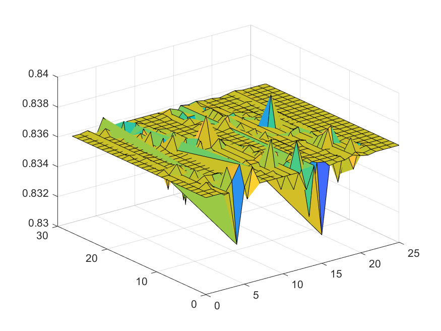
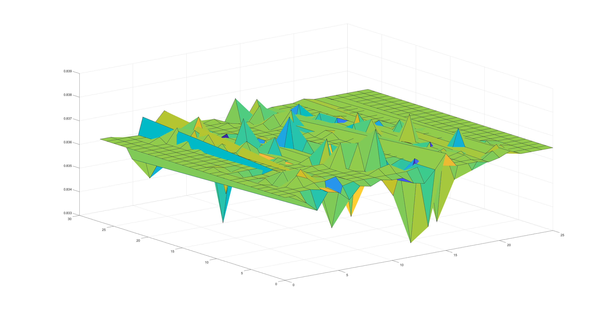
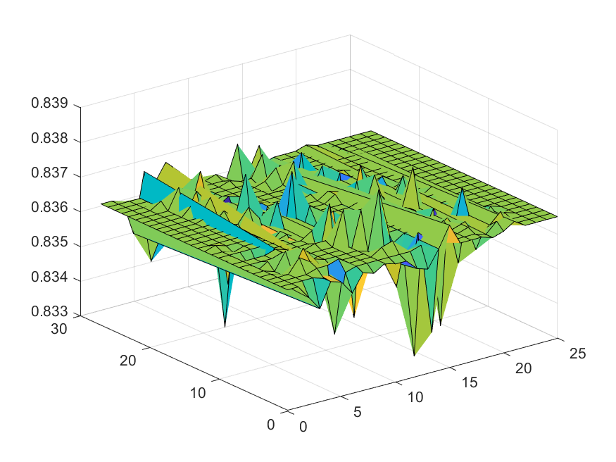

# Weight-Sensitivity-Analysis
Ever wondered how changing the weights of a neural network using the MNIST dataset can affect the accuracy of a a given neural network? A modern security bug known as row-
hammering which tampers with memory in hardware by continously pre-charging and activating rows of memory can force charge to move and flip bits in adjacent rows without 
even being accessed! This is a neural network model that uses the MNIST dataset with digits from 0-9. Below are images of the mean and variance for each digit in the samples
of the MNIST dataset as well as sample plots of changes for digits zero, six, and seven.

# Results
- Zero

- Six

- Seven

